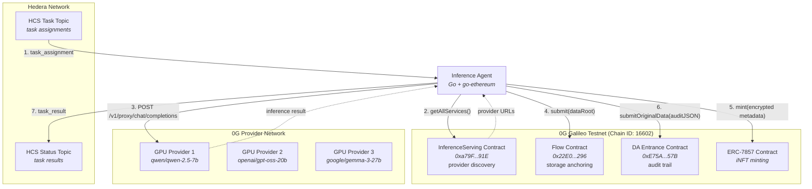

# agent-inference

Decentralized AI inference agent built on the [0G](https://0g.ai) compute ecosystem.

Part of the [ETHDenver 2026 Agent Economy](../README.md) submission.

## Overview

The inference agent routes AI workloads through a full decentralized pipeline: receives task assignments from the coordinator via Hedera Consensus Service (HCS), discovers GPU providers on-chain from the 0G InferenceServing contract, dispatches inference via OpenAI-compatible REST, persists results to 0G Storage with on-chain anchoring, mints encrypted ERC-7857 iNFTs for provenance, and publishes an immutable audit trail to 0G Data Availability (DA).

No centralized API keys. No single-provider lock-in. The agent dynamically discovers available GPU providers from the 0G serving contract and routes jobs to the best available endpoint.

## Built with Obedience Corp

This project is part of an [Obedience Corp](https://obediencecorp.com) campaign -- built and planned using **camp** (campaign management) and **fest** (festival methodology). This repository, its git history, and the planning artifacts in `festivals/` are a live example of these tools in action.

## Architecture



### Pipeline Stages

Each task flows through seven sequential stages:

| Stage | Service | Action |
|-------|---------|--------|
| 1. Receive | Hedera HCS | Subscribe to task topic, parse `task_assignment` envelope |
| 2. Discover | 0G InferenceServing | Call `getAllServices()` on-chain, cache providers for 5 min |
| 3. Infer | 0G Compute (GPU) | `POST /v1/proxy/chat/completions` to provider endpoint |
| 4. Store | 0G Storage + Flow | SHA-256 data root anchored on-chain, blob uploaded to storage node |
| 5. Mint | 0G Chain (ERC-7857) | AES-256-GCM encrypted metadata, provenance NFT minted |
| 6. Audit | 0G DA | Full event JSON submitted to DA Entrance contract |
| 7. Report | Hedera HCS | Publish `task_result` with output, storage ref, iNFT ID, DA ref |

Any stage failure marks the task as failed and publishes a `task_result` with `status: "failed"` back to the coordinator.

## 0G Integration Details

### Compute: On-Chain Provider Discovery

The agent reads the `InferenceServing` contract at `0xa79F4c8311FF93C06b8CfB403690cc987c93F91E` to discover GPU providers. Each provider registers with:

- **Model identifier** (e.g., `qwen/qwen-2.5-7b-instruct`, `google/gemma-3-27b-it`)
- **Endpoint URL** for OpenAI-compatible inference
- **Pricing** (input/output token costs)
- **Verifiability** metadata

The broker calls `getAllServices(offset, limit)` with pagination (max 50 per page, contract-enforced). Results are cached for 5 minutes. Live testing on Galileo discovers 4+ active providers.

### Storage: On-Chain Data Anchoring

Results are persisted through 0G Storage with a two-step process:

1. Compute `SHA-256(data)` as data root
2. Call `submit(dataRoot, length)` on the Flow contract at `0x22E03a6A89B950F1c82ec5e74F8eCa321a105296`
3. Upload blob to storage node with content ID matching the anchored root

### iNFT: Encrypted Provenance (ERC-7857)

Each inference result mints an ERC-7857 token on 0G Chain:

- **Encryption**: AES-256-GCM with random nonce per mint
- **On-chain data**: name, description, encrypted metadata blob, result hash, storage content ID
- **Token ID**: Extracted from the `Transfer` event in the mint receipt

### Data Availability: Immutable Audit Trail

Every pipeline event is submitted to the DA Entrance contract at `0xE75A073dA5bb7b0eC622170Fd268f35E675a957B`:

| Event | When |
|-------|------|
| `task_received` | Task assignment arrives from HCS |
| `job_submitted` | Inference request sent to provider |
| `job_completed` | Inference result received |
| `result_stored` | Data anchored on-chain and uploaded |
| `inft_minted` | ERC-7857 token minted |
| `result_reported` | Task result published to HCS |

Each submission is verifiable via `isDataAvailable(dataRoot)`.

## Quick Start

```bash
cp .env.example .env   # fill in values below
just build
just run
```

## Prerequisites

- Go 1.24+
- Hedera testnet account ([portal.hedera.com](https://portal.hedera.com))
- 0G Galileo testnet account with funded wallet
- 0G Storage node endpoint (optional for full pipeline)

## Configuration

### Hedera Transport

| Variable | Description |
|----------|-------------|
| `HEDERA_ACCOUNT_ID` | Hedera testnet account (0.0.xxx) |
| `HEDERA_PRIVATE_KEY` | Hedera private key |
| `HCS_TASK_TOPIC` | Topic ID for receiving task assignments |
| `HCS_RESULT_TOPIC` | Topic ID for publishing results |

### 0G Services

| Variable | Default | Description |
|----------|---------|-------------|
| `ZG_CHAIN_RPC` | `https://evmrpc-testnet.0g.ai` | 0G Galileo EVM RPC endpoint |
| `ZG_CHAIN_PRIVATE_KEY` | (required) | Hex-encoded ECDSA private key |
| `ZG_SERVING_CONTRACT` | `0xa79F...91E` | InferenceServing contract for provider discovery |
| `ZG_COMPUTE_ENDPOINT` | | Fallback HTTP compute endpoint |
| `ZG_FLOW_CONTRACT` | `0x22E0...296` | Flow contract for storage anchoring |
| `ZG_STORAGE_NODE_ENDPOINT` | | 0G Storage node HTTP URL |
| `ZG_INFT_CONTRACT` | | ERC-7857 iNFT contract address |
| `ZG_ENCRYPTION_KEY` | | Hex-encoded 32-byte AES-256 key |
| `ZG_ENCRYPTION_KEY_ID` | `default` | Key rotation identifier |
| `ZG_DA_CONTRACT` | `0xE75A...57B` | DA Entrance contract address |
| `ZG_DA_NAMESPACE` | `inference-audit` | DA namespace for audit events |

### Agent

| Variable | Default | Description |
|----------|---------|-------------|
| `INFERENCE_AGENT_ID` | (required) | Unique agent identifier |
| `INFERENCE_HEALTH_INTERVAL` | `30s` | Health heartbeat cadence |

## Project Structure

```
cmd/agent-inference/       Entry point, dependency wiring
internal/
  agent/                   Agent lifecycle, config, pipeline orchestration
  hcs/                     HCS publish/subscribe transport (Hiero SDK)
  zerog/
    compute/               0G Compute broker (on-chain discovery + OpenAI REST)
    storage/               0G Storage client (Flow contract + node upload)
    inft/                  ERC-7857 iNFT minter (AES-256-GCM encrypted metadata)
    da/                    0G Data Availability publisher (DA Entrance contract)
    chain.go               Shared chain client, key loading, transact opts
    zgtest/                Mock backends for unit tests
```

## Development

```bash
just build      # Build binary to bin/
just run        # Run the agent
just test       # Run unit tests
just lint       # golangci-lint
just fmt        # gofmt
just clean      # Remove build artifacts
```

### Live Tests

```bash
# Discover providers on Galileo testnet (requires ZG_CHAIN_RPC)
go test -tags live -run TestLive_ListModels ./internal/zerog/compute/

# Attempt inference against a live provider
go test -tags live -run TestLive_SubmitJob ./internal/zerog/compute/
```

## 0G Track 2 Alignment

This project targets the **0G Track 2: Decentralized AI Compute** bounty.

| Requirement | Implementation |
|-------------|----------------|
| Decentralized GPU inference | Jobs dispatched to providers discovered from on-chain InferenceServing contract; no hardcoded endpoints |
| 0G Compute Network integration | OpenAI-compatible REST against provider URLs registered on Galileo testnet |
| On-chain data anchoring | Inference results anchored via Flow contract `submit()` before storage upload |
| Data provenance | ERC-7857 iNFT minted per inference with encrypted metadata and result hash |
| Audit trail | Full pipeline events published to DA Entrance contract, verifiable on-chain |
| Multiple 0G services used | Compute + Storage + Chain (iNFT) + DA -- all four 0G subsystems integrated |

### Native Hedera Services Used

The agent also demonstrates cross-chain interoperability by receiving tasks and reporting results through Hedera HCS, while all compute and data operations flow through 0G:

- **HCS**: Task assignment subscription and result publication
- **HTS**: Payment settlement (via coordinator) for completed inference tasks

## License

MIT
